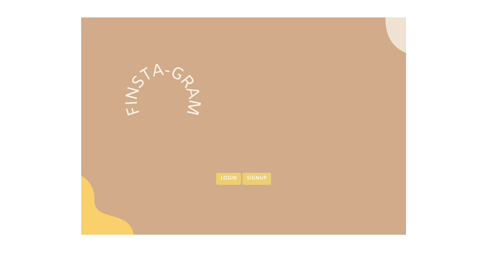
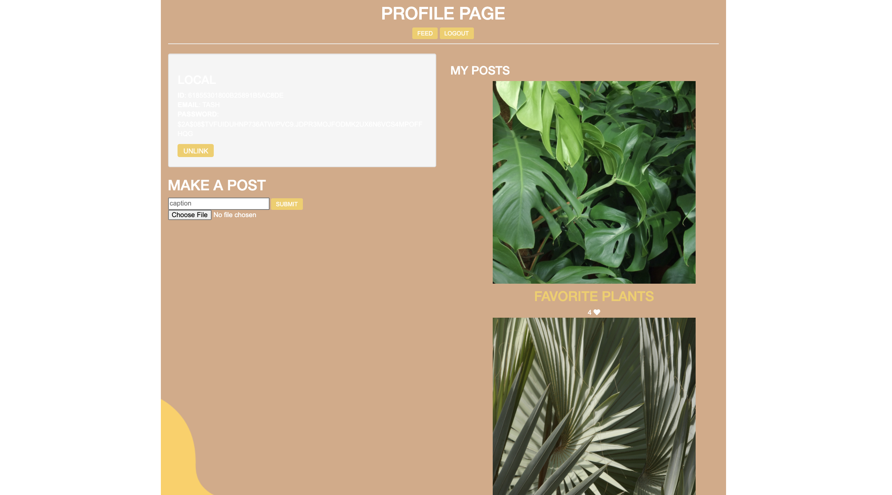
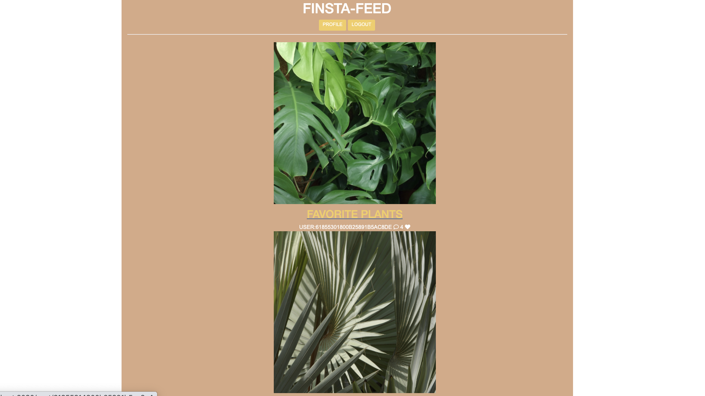

# Finsta-Gram Full Stack Application

# Description: 

Created a web application that allows users to sign-up or login to an account, view a feed of users posts, add their own posts and images, and like/comment on other users posts.
# Tech Used:

 HTML, CSS, JS, API, JSON, NODE.JS, EXPRESS, MONGODB, USER AUTH